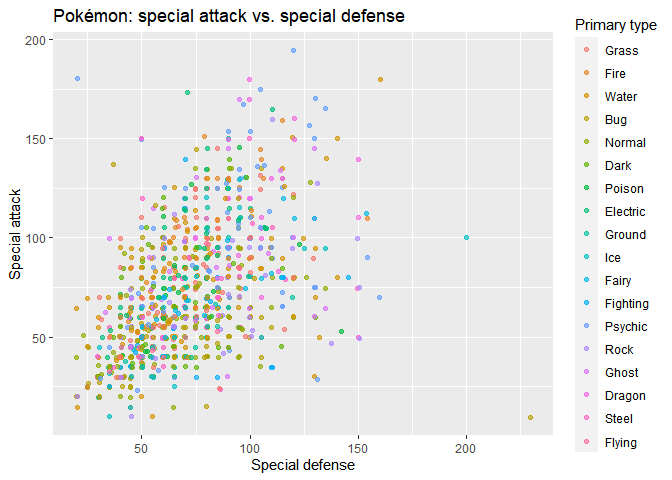

Functions and loading data
================
Joshua Megnauth

  - [What are functions?](#what-are-functions)
      - [We have to talk about
        parameters\!](#we-have-to-talk-about-parameters)
      - [Some useful, built-in
        functions](#some-useful-built-in-functions)
  - [Finally, let’s load some data](#finally-lets-load-some-data)
  - [Writing functions](#writing-functions)

# What are functions?

Functions are reusable blocks of code that perform some action. For
example, R implements functions for measures of central tendency by
default. You can simply call a function rather than calculating the mean
or median by verbosely writing code each time. We’ll take a quick look
at using functions since basically everything you’ll do involves calling
functions in some way. Functions are called also called *commands* in R
so don’t be confused if you see both terms.

Let’s look at how to call a function:

``` r
mean(airquality$Wind)
```

    ## [1] 9.957516

The syntax for calling a function is basically like functions in math as
well as other programming languages: `name(parameters)`

Functions may take zero or more *parameters* (also known as
*arguments*). Parameters provide input or options to the function. I
call the mean function above by passing in the Wind column from the
*airquality* data set.

## We have to talk about parameters\!

**No programmer memorizes functions.**

As a programmer you’ll likely have documentation open constantly while
coding. Let’s work through an example of using the documentation and
function parameters.

[Open this link
please.](https://www.rdocumentation.org/packages/base/versions/3.6.2/topics/mean)
Or, alternatively, type `?mean` in your R session (the **Console** tab).

Mean’s description states that the function calculates the “(trimmed)
arithmetic mean.” What does the function mean by “trimmed”? We can see
under the *arguments* section that the function takes a *trim* parameter
which is a “fraction” of “observations to be trimmed from each end of x
before the mean is computed.” Trimming removes a fraction (such as 0.1
or 10%) of observations before calculating the mean.

Next, let’s look at the **na.rm** argument. The parameter **na.rm**
“indicat\[es\] whether NA values should be stripped before the
computation proceeds.” We can’t perform math on `NA` (missing) values.

``` r
14 + NA
```

    ## [1] NA

Thus, the mean function has a parameter to ignore `NA` values to ensure
computation actually succeeds.

``` r
mean(airquality$Ozone)
```

    ## [1] NA

The mean function explicitly returns `NA` because the Ozone column is
missing some observations. Mean attempts to sum the observations with
the `NA` which results in `NA`.

``` r
mean(airquality$Ozone, na.rm = TRUE)
```

    ## [1] 42.12931

Notice that I called the function with `na.rm = TRUE`. Functions may be
called by passing in arguments by position, by name, or mixing the two.
The position of each arguments is shown in the documents. Looking back
at mean we can see that `x`, our data, is the first parameter. The
arguments `trim`, `na.rm`, and variadic follow. I pass
`airquality$Ozone` by position which matches the argument `x`. I
**have** to use `na.rm = TRUE` because the second argument is `trim`. R
wouldn’t know what to do if we do something like this:

``` r
mean(airquality$Ozone, TRUE)
```

    ## Error in mean.default(airquality$Ozone, TRUE): 'trim' must be numeric of length one

The interpreter is trying to match `TRUE` to `trim` as you can see from
the error.

## Some useful, built-in functions

Note that this list will clearly not be exhaustive. But I’d like you to
at least get an idea of some of the functions available.

  - [mean()](https://www.rdocumentation.org/packages/base/versions/3.6.2/topics/mean)
  - [median()](https://www.rdocumentation.org/packages/stats/versions/3.6.2/topics/median)
  - [lm()](https://www.rdocumentation.org/packages/stats/versions/3.6.2/topics/lm)
  - [glm()](https://www.rdocumentation.org/packages/stats/versions/3.6.2/topics/glm)
  - [dbinom(), pbinom(), qbinom(),
    rbinom()](https://www.rdocumentation.org/packages/stats/versions/3.3/topics/Binomial)
  - [dnorm(), pnorm(), qnorm(),
    rnorm()](https://www.rdocumentation.org/packages/stats/versions/3.6.2/topics/Normal)
  - [sd](https://www.rdocumentation.org/packages/stats/versions/3.6.2/topics/sd)
  - [read.csv()](https://www.rdocumentation.org/packages/utils/versions/3.6.2/topics/read.table)

# Finally, let’s load some data

Type `?read_csv` and `?read.csv`.

The functions `read.csv` and `read_csv` both read CSV files but the
latter is a **tidyverse** function that returns tibbles. You can use
either for your purposes, but I prefer using tidy functions whenever
possible.

Data, like basically everything in computing, is distributed in a passel
of different formats which all have their pros and cons—except Excel
spreadsheets which are all cons and no pros. CSV stands for comma
separated values as you saw in professor Cohen’s lecture. CSV’s acronym
literally tells you what it is: a sequence of values separated by
commas. CSVs may be delimited by tabs or semicolons as well. If you
looked at the documentation you’d notice that the `delim` parameter can
be used to specify a different delimiter.

 

The above pictures show examples of CSV files based on data I gathered
for my thesis. If you’re curious [my source
code](https://github.com/joshuamegnauth54/thesis_gamer_scraper) for the
program I wrote to gather my data from Reddit is open sourced on GitHub.
The first picture shows the CSV after parsing to delinate the columns.
The second picture displays the raw CSV. You can see the commas
separating each observation in each row.

Anyway, let’s load a CSV\! First we’ll load up the library
[readr](https://readr.tidyverse.org/) from the tidyverse.

``` r
library(readr)
```

You’ll need the **tidyverse** installed. Install the tidyverse via the
console as discussed in my last mini tutorial if you don’t have it.

``` r
pokemon_df <- read_csv("pokemon.csv")
```

And let’s do a cool graph (which I’ll show you how to make in the next
microtutorial, so don’t worry that this totally escalated in one ms)…

``` r
library(tidyverse)

pokemon_df %>%
  mutate(type1 = as_factor(type1)) %>%
  ggplot(aes(sp_defense, sp_attack, color = type1)) +
  geom_jitter(alpha = 0.65) +
  xlab("Special defense") +
  ylab("Special attack") +
  ggtitle("Pokémon: special attack vs. special defense") +
  scale_color_discrete(name = "Primary type")
```

<!-- -->

**Note:** I didn’t use the official type colors here as this is a quick
and dirty chart.

# Writing functions

**You may safely ignore this section if you don’t care about writing
functions as I’m targetting this to the people who have programmed in
the past.**

R’s teleological end is pragmatic data science, so many R programmers
don’t write their own functions as well as write throw away scripts.
However, I know some of you have programmed before—and if you’re like me
your first question when starting a new language is “how do I write a
function?\!” Functions in R work about the same as in other languages.

``` r
standardize <- function(data, na.rm = FALSE) {
  (data - mean(data, na.rm = na.rm))/sd(data, na.rm = na.rm)
}

pokemon_df %>%
  mutate(HP = standardize(hp),
         Attack = standardize(attack)) %>%
  summarize(`HP mean` = mean(HP),
            `HP standard deviation` = sd(HP),
            `Attack mean` = mean(Attack),
            `Attack standard deviation` = sd(Attack)) %>%
  kableExtra::kable(knitr.table.format = "markdown")
```

<table>

<thead>

<tr>

<th style="text-align:right;">

HP mean

</th>

<th style="text-align:right;">

HP standard deviation

</th>

<th style="text-align:right;">

Attack mean

</th>

<th style="text-align:right;">

Attack standard deviation

</th>

</tr>

</thead>

<tbody>

<tr>

<td style="text-align:right;">

0

</td>

<td style="text-align:right;">

1

</td>

<td style="text-align:right;">

0

</td>

<td style="text-align:right;">

1

</td>

</tr>

</tbody>

</table>

A standardized variable has a mean of zero and standard deviation of
one. Anyway, you can see from the function definition that the basic
syntax is somewhat similar to other language. Notably, you don’t need an
explicit `return` statement as the last line is returned anyway like in
functional languages like Rust. Also, notice that I pass `na.rm` down to
the functions that use the argument.

Finally\! R’s scoping operator may be used to explicitly call a function
from a certain library. You can see the scoping (`::`) operator in
action in my code above where I call `kableExtra::kable()` without
loading **kableExtra**. Functions may be shadowed when you load a
library with functions whose names overlap with already defined
functions. The scoping operator is useful to call the right function.

Functions in R are fantastically strange. I’m not even going to pretend
to try to cover half of the weird features available. If any of you are
interested I recommended reading up on S3 generics and the different
object systems available. And yes, there are *multiple* implementations
of OOP in R. You’ll likely not write your own classes unless you’re
writing an library/API, so you shouldn’t prioritize OOP just for the
experience if you’ve used an OOP language. R’s functional features are
more powerful anyway, so I recommend looking into
[purrr](https://purrr.tidyverse.org/) more than objects.
