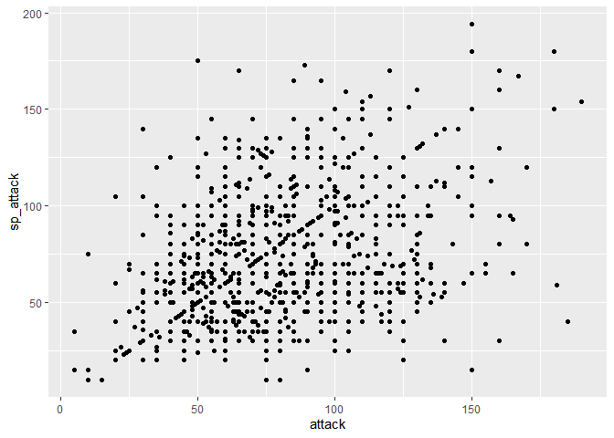
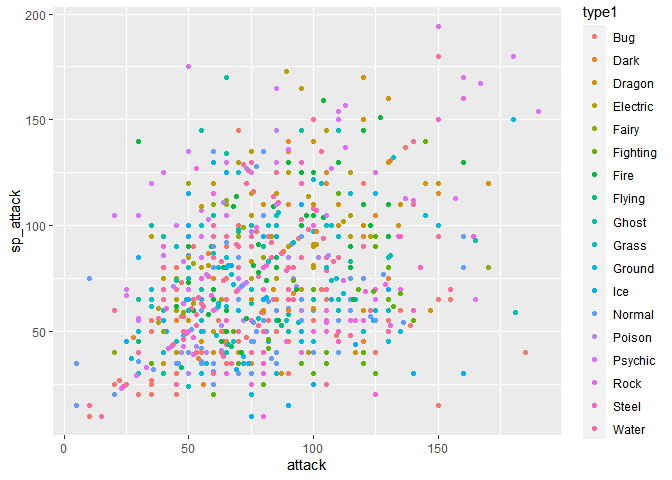
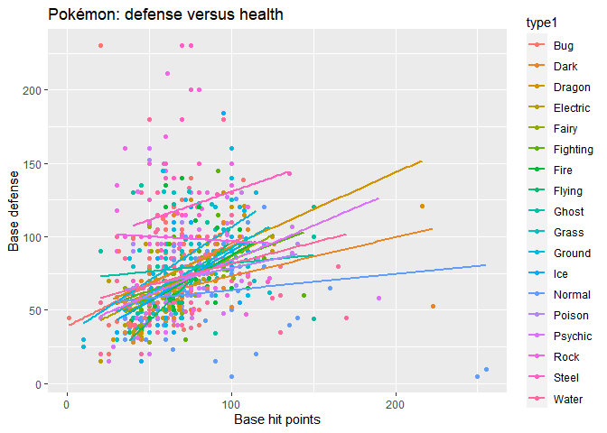

Introduction to ggplot
================
Joshua Megnauth

  - [Introduction](#introduction)
  - [Basics](#basics)
      - [An example](#an-example)
  - [Aesthetics](#aesthetics)
      - [An aside on types](#an-aside-on-types)

# Introduction

Ggplot follows the philosophy of the grammar of graphics which is based
off of the [epynonymous
book](https://www.springer.com/gp/book/9780387245447) by Leland
Wilkinson. Grammer of graphics refers to an intuition about plots based
on the elements that construct a graph. The interface allows a
programmer and statistician to construct a plot by working on units such
as layers or lines. I’m a huge Python fan, but I’m firmly in the ggplot
camp over Matplotlib/Seaborn. Matplotlib mimics a Matlab interface which
feels entirely unintuitive in Python.

Anyway\! I’ll write a very basic guide to using ggplot. Check out the
[documentation](https://ggplot2.tidyverse.org/) if you wish to learn
more.

# Basics

``` r
library(kableExtra)
library(tidyverse)
library(ggplot2)

pokemon_df <- read_csv("Pokemon_data.csv")
```

Don’t worry if you know little about Pokémon. Pokémon is not a
prerequisite to my tutorial. Also, I’m not cleaning or wrangling this
data in order to save time. You should always clean your data
regardless.

The two major parts of ggplot are **aesthetics** and **layers.** Take a
look at the **ggplot()** function’s help page with `?ggplot` in your
console. The **ggplot()** function essentially takes two parameters:
your data and your aesthetic mapping.

Next let’s take a look at `?aes` for help on the aesthetics function.
The manual explains that the function takes in parameters in the form
`aesthetic = variable` where *variable* is a variable/column in your
data and *aesthetic* refers to visual aspects of the plot itself.
Finally, the documentation mentions that **ggplot()** is “almost always
followed by +” to add layers.

Admittedly, these concepts are a bit abstract. Watching ggplot in action
would help you understand how the objects fit together. Take a gander at
the data before we begin so you have an idea how everything looks.

``` r
head(pokemon_df) %>%
  kable()
```

<table>

<thead>

<tr>

<th style="text-align:right;">

pokedex\_number

</th>

<th style="text-align:left;">

name

</th>

<th style="text-align:right;">

generation

</th>

<th style="text-align:left;">

classfication

</th>

<th style="text-align:left;">

abilities

</th>

<th style="text-align:right;">

height\_m

</th>

<th style="text-align:right;">

weight\_kg

</th>

<th style="text-align:left;">

type1

</th>

<th style="text-align:left;">

type2

</th>

<th style="text-align:right;">

base\_total

</th>

<th style="text-align:right;">

hp

</th>

<th style="text-align:right;">

attack

</th>

<th style="text-align:right;">

defense

</th>

<th style="text-align:right;">

sp\_attack

</th>

<th style="text-align:right;">

sp\_defense

</th>

<th style="text-align:right;">

speed

</th>

<th style="text-align:right;">

against\_bug

</th>

<th style="text-align:right;">

against\_dark

</th>

<th style="text-align:right;">

against\_dragon

</th>

<th style="text-align:right;">

against\_electric

</th>

<th style="text-align:right;">

against\_fairy

</th>

<th style="text-align:right;">

against\_fighting

</th>

<th style="text-align:right;">

against\_fire

</th>

<th style="text-align:right;">

against\_flying

</th>

<th style="text-align:right;">

against\_ghost

</th>

<th style="text-align:right;">

against\_grass

</th>

<th style="text-align:right;">

against\_ground

</th>

<th style="text-align:right;">

against\_ice

</th>

<th style="text-align:right;">

against\_normal

</th>

<th style="text-align:right;">

against\_poison

</th>

<th style="text-align:right;">

against\_psychic

</th>

<th style="text-align:right;">

against\_rock

</th>

<th style="text-align:right;">

against\_steel

</th>

<th style="text-align:right;">

against\_water

</th>

<th style="text-align:right;">

capture\_rate

</th>

<th style="text-align:right;">

base\_egg\_steps

</th>

<th style="text-align:right;">

base\_happiness

</th>

<th style="text-align:right;">

is\_legendary

</th>

<th style="text-align:right;">

is\_mythical

</th>

<th style="text-align:right;">

is\_mega

</th>

</tr>

</thead>

<tbody>

<tr>

<td style="text-align:right;">

1

</td>

<td style="text-align:left;">

Bulbasaur

</td>

<td style="text-align:right;">

1

</td>

<td style="text-align:left;">

Seed Pokémon

</td>

<td style="text-align:left;">

\[‘Overgrow’, ‘Chlorophyll’\]

</td>

<td style="text-align:right;">

0.7

</td>

<td style="text-align:right;">

6.9

</td>

<td style="text-align:left;">

Grass

</td>

<td style="text-align:left;">

Poison

</td>

<td style="text-align:right;">

318

</td>

<td style="text-align:right;">

45

</td>

<td style="text-align:right;">

49

</td>

<td style="text-align:right;">

49

</td>

<td style="text-align:right;">

65

</td>

<td style="text-align:right;">

65

</td>

<td style="text-align:right;">

45

</td>

<td style="text-align:right;">

1.0

</td>

<td style="text-align:right;">

1

</td>

<td style="text-align:right;">

1

</td>

<td style="text-align:right;">

0.5

</td>

<td style="text-align:right;">

0.5

</td>

<td style="text-align:right;">

0.5

</td>

<td style="text-align:right;">

2.0

</td>

<td style="text-align:right;">

2

</td>

<td style="text-align:right;">

1

</td>

<td style="text-align:right;">

0.25

</td>

<td style="text-align:right;">

1

</td>

<td style="text-align:right;">

2.0

</td>

<td style="text-align:right;">

1

</td>

<td style="text-align:right;">

1

</td>

<td style="text-align:right;">

2

</td>

<td style="text-align:right;">

1

</td>

<td style="text-align:right;">

1.0

</td>

<td style="text-align:right;">

0.5

</td>

<td style="text-align:right;">

45

</td>

<td style="text-align:right;">

5140

</td>

<td style="text-align:right;">

70

</td>

<td style="text-align:right;">

0

</td>

<td style="text-align:right;">

0

</td>

<td style="text-align:right;">

0

</td>

</tr>

<tr>

<td style="text-align:right;">

2

</td>

<td style="text-align:left;">

Ivysaur

</td>

<td style="text-align:right;">

1

</td>

<td style="text-align:left;">

Seed Pokémon

</td>

<td style="text-align:left;">

\[‘Overgrow’, ‘Chlorophyll’\]

</td>

<td style="text-align:right;">

1.0

</td>

<td style="text-align:right;">

13.0

</td>

<td style="text-align:left;">

Grass

</td>

<td style="text-align:left;">

Poison

</td>

<td style="text-align:right;">

405

</td>

<td style="text-align:right;">

60

</td>

<td style="text-align:right;">

62

</td>

<td style="text-align:right;">

63

</td>

<td style="text-align:right;">

80

</td>

<td style="text-align:right;">

80

</td>

<td style="text-align:right;">

60

</td>

<td style="text-align:right;">

1.0

</td>

<td style="text-align:right;">

1

</td>

<td style="text-align:right;">

1

</td>

<td style="text-align:right;">

0.5

</td>

<td style="text-align:right;">

0.5

</td>

<td style="text-align:right;">

0.5

</td>

<td style="text-align:right;">

2.0

</td>

<td style="text-align:right;">

2

</td>

<td style="text-align:right;">

1

</td>

<td style="text-align:right;">

0.25

</td>

<td style="text-align:right;">

1

</td>

<td style="text-align:right;">

2.0

</td>

<td style="text-align:right;">

1

</td>

<td style="text-align:right;">

1

</td>

<td style="text-align:right;">

2

</td>

<td style="text-align:right;">

1

</td>

<td style="text-align:right;">

1.0

</td>

<td style="text-align:right;">

0.5

</td>

<td style="text-align:right;">

45

</td>

<td style="text-align:right;">

5140

</td>

<td style="text-align:right;">

70

</td>

<td style="text-align:right;">

0

</td>

<td style="text-align:right;">

0

</td>

<td style="text-align:right;">

0

</td>

</tr>

<tr>

<td style="text-align:right;">

3

</td>

<td style="text-align:left;">

Venusaur

</td>

<td style="text-align:right;">

1

</td>

<td style="text-align:left;">

Seed Pokémon

</td>

<td style="text-align:left;">

\[‘Overgrow’, ‘Chlorophyll’\]

</td>

<td style="text-align:right;">

2.0

</td>

<td style="text-align:right;">

100.0

</td>

<td style="text-align:left;">

Grass

</td>

<td style="text-align:left;">

Poison

</td>

<td style="text-align:right;">

525

</td>

<td style="text-align:right;">

80

</td>

<td style="text-align:right;">

82

</td>

<td style="text-align:right;">

83

</td>

<td style="text-align:right;">

100

</td>

<td style="text-align:right;">

100

</td>

<td style="text-align:right;">

80

</td>

<td style="text-align:right;">

1.0

</td>

<td style="text-align:right;">

1

</td>

<td style="text-align:right;">

1

</td>

<td style="text-align:right;">

0.5

</td>

<td style="text-align:right;">

0.5

</td>

<td style="text-align:right;">

0.5

</td>

<td style="text-align:right;">

2.0

</td>

<td style="text-align:right;">

2

</td>

<td style="text-align:right;">

1

</td>

<td style="text-align:right;">

0.25

</td>

<td style="text-align:right;">

1

</td>

<td style="text-align:right;">

2.0

</td>

<td style="text-align:right;">

1

</td>

<td style="text-align:right;">

1

</td>

<td style="text-align:right;">

2

</td>

<td style="text-align:right;">

1

</td>

<td style="text-align:right;">

1.0

</td>

<td style="text-align:right;">

0.5

</td>

<td style="text-align:right;">

45

</td>

<td style="text-align:right;">

5140

</td>

<td style="text-align:right;">

70

</td>

<td style="text-align:right;">

0

</td>

<td style="text-align:right;">

0

</td>

<td style="text-align:right;">

0

</td>

</tr>

<tr>

<td style="text-align:right;">

3

</td>

<td style="text-align:left;">

Mega Venusaur

</td>

<td style="text-align:right;">

1

</td>

<td style="text-align:left;">

Seed Pokémon

</td>

<td style="text-align:left;">

\[‘Thick Fat’\]

</td>

<td style="text-align:right;">

2.4

</td>

<td style="text-align:right;">

155.5

</td>

<td style="text-align:left;">

Grass

</td>

<td style="text-align:left;">

Poison

</td>

<td style="text-align:right;">

625

</td>

<td style="text-align:right;">

80

</td>

<td style="text-align:right;">

100

</td>

<td style="text-align:right;">

123

</td>

<td style="text-align:right;">

122

</td>

<td style="text-align:right;">

120

</td>

<td style="text-align:right;">

80

</td>

<td style="text-align:right;">

1.0

</td>

<td style="text-align:right;">

1

</td>

<td style="text-align:right;">

1

</td>

<td style="text-align:right;">

0.5

</td>

<td style="text-align:right;">

0.5

</td>

<td style="text-align:right;">

0.5

</td>

<td style="text-align:right;">

1.0

</td>

<td style="text-align:right;">

2

</td>

<td style="text-align:right;">

1

</td>

<td style="text-align:right;">

0.25

</td>

<td style="text-align:right;">

1

</td>

<td style="text-align:right;">

1.0

</td>

<td style="text-align:right;">

1

</td>

<td style="text-align:right;">

1

</td>

<td style="text-align:right;">

2

</td>

<td style="text-align:right;">

1

</td>

<td style="text-align:right;">

1.0

</td>

<td style="text-align:right;">

0.5

</td>

<td style="text-align:right;">

45

</td>

<td style="text-align:right;">

5140

</td>

<td style="text-align:right;">

70

</td>

<td style="text-align:right;">

0

</td>

<td style="text-align:right;">

0

</td>

<td style="text-align:right;">

1

</td>

</tr>

<tr>

<td style="text-align:right;">

4

</td>

<td style="text-align:left;">

Charmander

</td>

<td style="text-align:right;">

1

</td>

<td style="text-align:left;">

Lizard Pokémon

</td>

<td style="text-align:left;">

\[‘Blaze’, ‘Solar Power’\]

</td>

<td style="text-align:right;">

0.6

</td>

<td style="text-align:right;">

8.5

</td>

<td style="text-align:left;">

Fire

</td>

<td style="text-align:left;">

None

</td>

<td style="text-align:right;">

309

</td>

<td style="text-align:right;">

39

</td>

<td style="text-align:right;">

52

</td>

<td style="text-align:right;">

43

</td>

<td style="text-align:right;">

60

</td>

<td style="text-align:right;">

50

</td>

<td style="text-align:right;">

65

</td>

<td style="text-align:right;">

0.5

</td>

<td style="text-align:right;">

1

</td>

<td style="text-align:right;">

1

</td>

<td style="text-align:right;">

1.0

</td>

<td style="text-align:right;">

0.5

</td>

<td style="text-align:right;">

1.0

</td>

<td style="text-align:right;">

0.5

</td>

<td style="text-align:right;">

1

</td>

<td style="text-align:right;">

1

</td>

<td style="text-align:right;">

0.50

</td>

<td style="text-align:right;">

2

</td>

<td style="text-align:right;">

0.5

</td>

<td style="text-align:right;">

1

</td>

<td style="text-align:right;">

1

</td>

<td style="text-align:right;">

1

</td>

<td style="text-align:right;">

2

</td>

<td style="text-align:right;">

0.5

</td>

<td style="text-align:right;">

2.0

</td>

<td style="text-align:right;">

45

</td>

<td style="text-align:right;">

5140

</td>

<td style="text-align:right;">

70

</td>

<td style="text-align:right;">

0

</td>

<td style="text-align:right;">

0

</td>

<td style="text-align:right;">

0

</td>

</tr>

<tr>

<td style="text-align:right;">

5

</td>

<td style="text-align:left;">

Charmeleon

</td>

<td style="text-align:right;">

1

</td>

<td style="text-align:left;">

Flame Pokémon

</td>

<td style="text-align:left;">

\[‘Blaze’, ‘Solar Power’\]

</td>

<td style="text-align:right;">

1.1

</td>

<td style="text-align:right;">

19.0

</td>

<td style="text-align:left;">

Fire

</td>

<td style="text-align:left;">

None

</td>

<td style="text-align:right;">

405

</td>

<td style="text-align:right;">

58

</td>

<td style="text-align:right;">

64

</td>

<td style="text-align:right;">

58

</td>

<td style="text-align:right;">

80

</td>

<td style="text-align:right;">

65

</td>

<td style="text-align:right;">

80

</td>

<td style="text-align:right;">

0.5

</td>

<td style="text-align:right;">

1

</td>

<td style="text-align:right;">

1

</td>

<td style="text-align:right;">

1.0

</td>

<td style="text-align:right;">

0.5

</td>

<td style="text-align:right;">

1.0

</td>

<td style="text-align:right;">

0.5

</td>

<td style="text-align:right;">

1

</td>

<td style="text-align:right;">

1

</td>

<td style="text-align:right;">

0.50

</td>

<td style="text-align:right;">

2

</td>

<td style="text-align:right;">

0.5

</td>

<td style="text-align:right;">

1

</td>

<td style="text-align:right;">

1

</td>

<td style="text-align:right;">

1

</td>

<td style="text-align:right;">

2

</td>

<td style="text-align:right;">

0.5

</td>

<td style="text-align:right;">

2.0

</td>

<td style="text-align:right;">

45

</td>

<td style="text-align:right;">

5140

</td>

<td style="text-align:right;">

70

</td>

<td style="text-align:right;">

0

</td>

<td style="text-align:right;">

0

</td>

<td style="text-align:right;">

0

</td>

</tr>

</tbody>

</table>

## An example

``` r
ggplot(pokemon_df, aes(x = attack, y = sp_attack)) +
  geom_point()
```

<!-- -->

The above plot demonstrates what we discussed above. First, I call
**ggplot()** by passing in my data, **pokemon\_df.** The second argument
is an aesthetic mapping that maps `attack` to `x` and `sp_attack` to
`y`; both of those are columns in my data, of course. The x and y axis
are not the only aesthetics. My favorite aesthetic (not including x and
y) is color which we’ll look at in a bit.

After calling ggplot we have to provide layers to do the actual
plotting. The function **geom\_point()** creates a scatter plot based on
the aesthetics provided to **ggplot()** *or* to aesthetics provided to
**geom\_point().** This distinction is important, but we can’t discuss
it just yet.

Anyway, with that we have our basic, untitled, and decidedly gray plot\!

# Aesthetics

The ggplot library allows simple additions of more aesthetics. Take a
look at our call to **ggplot()** where we map `attack` and `sp_attack`
to `x` and `y` respectively. The color aesthetic maps

How would we map the variable `type1` to `color`? Try creating the graph
yourself—that is, remaking the graph above but adding the color
aesthetic as well.

``` r
ggplot(pokemon_df, aes(attack, sp_attack, color = type1)) +
  geom_point()
```

<!-- -->

Adding the color aesthetic is as simple as passing in the unquoted name
of a column to `color`. Notice that I didn’t write `x = attack, y =
sp_attack`. The first two arguments are `x` and `y` which means we may
pass in parameters by position as discussed in my microtutorial on
functions.

We can also overlay plots (hence why they’re known as layers) as well as
add titles and axis labels. Let’s use two different variables to
demonstrate the above.

``` r
ggplot(pokemon_df, aes(hp, defense, color = type1)) +
  geom_point() +
  geom_smooth(method = lm, se = FALSE) +
  ggtitle("Pokémon: defense versus health") +
  xlab("Base hit points") +
  ylab("Base defense")
```

    ## `geom_smooth()` using formula 'y ~ x'

<!-- -->

## An aside on types

geom\_bar with generation not as a factor histogram bar with continous
transformations
