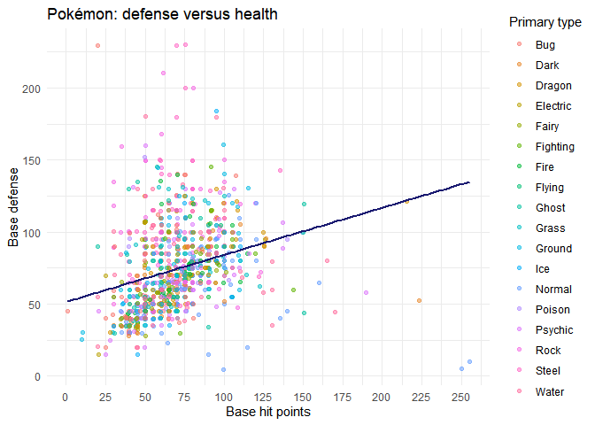
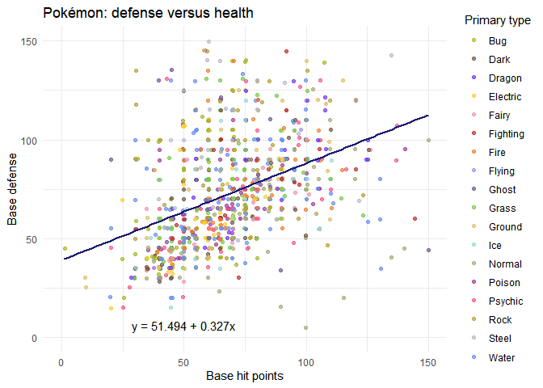

Introduction to ggplot
================
Joshua Megnauth

  - [Introduction](#introduction)
  - [This is unfinished. Don’t read it before class\! Thanks\!
    :)](#this-is-unfinished.-dont-read-it-before-class-thanks)
  - [Basics](#basics)
      - [An example](#an-example)
  - [Aesthetics](#aesthetics)
      - [Improving our scatter plot](#improving-our-scatter-plot)
      - [Zooming in with xlim/ylim and setting a custom color
        scale](#zooming-in-with-xlimylim-and-setting-a-custom-color-scale)
      - [An aside on types](#an-aside-on-types)

# Introduction

# This is unfinished. Don’t read it before class\! Thanks\! :)

Ggplot follows the philosophy of the grammar of graphics which is based
off of the [epynonymous
book](https://www.springer.com/gp/book/9780387245447) by Leland
Wilkinson. Grammer of graphics refers to an intuition about plots based
on the elements that construct a graph. The interface allows a
programmer and statistician to construct a plot by working on units such
as layers or lines. I’m a huge Python fan, but I’m firmly in the ggplot
camp over Matplotlib/Seaborn. Matplotlib mimics a Matlab interface which
feels entirely unintuitive in Python.

Anyway\! I’ll write a very basic guide to using ggplot. Check out the
[documentation](https://ggplot2.tidyverse.org/) if you wish to learn
more.

# Basics

``` r
library(kableExtra)
library(tidyverse)
library(ggplot2)

pokemon_df <- read_csv("Pokemon_data.csv")
```

Don’t worry if you know little about Pokémon. Pokémon is not a
prerequisite to my tutorial. Also, I’m not cleaning or wrangling this
data in order to save time. You should always clean your data
regardless.

The two major parts of ggplot are **aesthetics** and **layers.** Take a
look at the **ggplot()** function’s help page with `?ggplot` in your
console. The **ggplot()** function essentially takes two parameters:
your data and your aesthetic mapping.

Next let’s take a look at `?aes` for help on the aesthetics function.
The manual explains that the function takes in parameters in the form
`aesthetic = variable` where *variable* is a variable/column in your
data and *aesthetic* refers to visual aspects of the plot itself.
Finally, the documentation mentions that **ggplot()** is “almost always
followed by +” to add layers.

Admittedly, these concepts are a bit abstract. Watching ggplot in action
would help you understand how the objects fit together. Take a gander at
the data before we begin so you have an idea how everything looks.

``` r
head(pokemon_df) %>%
  kable()
```

<table>

<thead>

<tr>

<th style="text-align:right;">

pokedex\_number

</th>

<th style="text-align:left;">

name

</th>

<th style="text-align:right;">

generation

</th>

<th style="text-align:left;">

classfication

</th>

<th style="text-align:left;">

abilities

</th>

<th style="text-align:right;">

height\_m

</th>

<th style="text-align:right;">

weight\_kg

</th>

<th style="text-align:left;">

type1

</th>

<th style="text-align:left;">

type2

</th>

<th style="text-align:right;">

base\_total

</th>

<th style="text-align:right;">

hp

</th>

<th style="text-align:right;">

attack

</th>

<th style="text-align:right;">

defense

</th>

<th style="text-align:right;">

sp\_attack

</th>

<th style="text-align:right;">

sp\_defense

</th>

<th style="text-align:right;">

speed

</th>

<th style="text-align:right;">

against\_bug

</th>

<th style="text-align:right;">

against\_dark

</th>

<th style="text-align:right;">

against\_dragon

</th>

<th style="text-align:right;">

against\_electric

</th>

<th style="text-align:right;">

against\_fairy

</th>

<th style="text-align:right;">

against\_fighting

</th>

<th style="text-align:right;">

against\_fire

</th>

<th style="text-align:right;">

against\_flying

</th>

<th style="text-align:right;">

against\_ghost

</th>

<th style="text-align:right;">

against\_grass

</th>

<th style="text-align:right;">

against\_ground

</th>

<th style="text-align:right;">

against\_ice

</th>

<th style="text-align:right;">

against\_normal

</th>

<th style="text-align:right;">

against\_poison

</th>

<th style="text-align:right;">

against\_psychic

</th>

<th style="text-align:right;">

against\_rock

</th>

<th style="text-align:right;">

against\_steel

</th>

<th style="text-align:right;">

against\_water

</th>

<th style="text-align:right;">

capture\_rate

</th>

<th style="text-align:right;">

base\_egg\_steps

</th>

<th style="text-align:right;">

base\_happiness

</th>

<th style="text-align:right;">

is\_legendary

</th>

<th style="text-align:right;">

is\_mythical

</th>

<th style="text-align:right;">

is\_mega

</th>

</tr>

</thead>

<tbody>

<tr>

<td style="text-align:right;">

1

</td>

<td style="text-align:left;">

Bulbasaur

</td>

<td style="text-align:right;">

1

</td>

<td style="text-align:left;">

Seed Pokémon

</td>

<td style="text-align:left;">

\[‘Overgrow’, ‘Chlorophyll’\]

</td>

<td style="text-align:right;">

0.7

</td>

<td style="text-align:right;">

6.9

</td>

<td style="text-align:left;">

Grass

</td>

<td style="text-align:left;">

Poison

</td>

<td style="text-align:right;">

318

</td>

<td style="text-align:right;">

45

</td>

<td style="text-align:right;">

49

</td>

<td style="text-align:right;">

49

</td>

<td style="text-align:right;">

65

</td>

<td style="text-align:right;">

65

</td>

<td style="text-align:right;">

45

</td>

<td style="text-align:right;">

1.0

</td>

<td style="text-align:right;">

1

</td>

<td style="text-align:right;">

1

</td>

<td style="text-align:right;">

0.5

</td>

<td style="text-align:right;">

0.5

</td>

<td style="text-align:right;">

0.5

</td>

<td style="text-align:right;">

2.0

</td>

<td style="text-align:right;">

2

</td>

<td style="text-align:right;">

1

</td>

<td style="text-align:right;">

0.25

</td>

<td style="text-align:right;">

1

</td>

<td style="text-align:right;">

2.0

</td>

<td style="text-align:right;">

1

</td>

<td style="text-align:right;">

1

</td>

<td style="text-align:right;">

2

</td>

<td style="text-align:right;">

1

</td>

<td style="text-align:right;">

1.0

</td>

<td style="text-align:right;">

0.5

</td>

<td style="text-align:right;">

45

</td>

<td style="text-align:right;">

5140

</td>

<td style="text-align:right;">

70

</td>

<td style="text-align:right;">

0

</td>

<td style="text-align:right;">

0

</td>

<td style="text-align:right;">

0

</td>

</tr>

<tr>

<td style="text-align:right;">

2

</td>

<td style="text-align:left;">

Ivysaur

</td>

<td style="text-align:right;">

1

</td>

<td style="text-align:left;">

Seed Pokémon

</td>

<td style="text-align:left;">

\[‘Overgrow’, ‘Chlorophyll’\]

</td>

<td style="text-align:right;">

1.0

</td>

<td style="text-align:right;">

13.0

</td>

<td style="text-align:left;">

Grass

</td>

<td style="text-align:left;">

Poison

</td>

<td style="text-align:right;">

405

</td>

<td style="text-align:right;">

60

</td>

<td style="text-align:right;">

62

</td>

<td style="text-align:right;">

63

</td>

<td style="text-align:right;">

80

</td>

<td style="text-align:right;">

80

</td>

<td style="text-align:right;">

60

</td>

<td style="text-align:right;">

1.0

</td>

<td style="text-align:right;">

1

</td>

<td style="text-align:right;">

1

</td>

<td style="text-align:right;">

0.5

</td>

<td style="text-align:right;">

0.5

</td>

<td style="text-align:right;">

0.5

</td>

<td style="text-align:right;">

2.0

</td>

<td style="text-align:right;">

2

</td>

<td style="text-align:right;">

1

</td>

<td style="text-align:right;">

0.25

</td>

<td style="text-align:right;">

1

</td>

<td style="text-align:right;">

2.0

</td>

<td style="text-align:right;">

1

</td>

<td style="text-align:right;">

1

</td>

<td style="text-align:right;">

2

</td>

<td style="text-align:right;">

1

</td>

<td style="text-align:right;">

1.0

</td>

<td style="text-align:right;">

0.5

</td>

<td style="text-align:right;">

45

</td>

<td style="text-align:right;">

5140

</td>

<td style="text-align:right;">

70

</td>

<td style="text-align:right;">

0

</td>

<td style="text-align:right;">

0

</td>

<td style="text-align:right;">

0

</td>

</tr>

<tr>

<td style="text-align:right;">

3

</td>

<td style="text-align:left;">

Venusaur

</td>

<td style="text-align:right;">

1

</td>

<td style="text-align:left;">

Seed Pokémon

</td>

<td style="text-align:left;">

\[‘Overgrow’, ‘Chlorophyll’\]

</td>

<td style="text-align:right;">

2.0

</td>

<td style="text-align:right;">

100.0

</td>

<td style="text-align:left;">

Grass

</td>

<td style="text-align:left;">

Poison

</td>

<td style="text-align:right;">

525

</td>

<td style="text-align:right;">

80

</td>

<td style="text-align:right;">

82

</td>

<td style="text-align:right;">

83

</td>

<td style="text-align:right;">

100

</td>

<td style="text-align:right;">

100

</td>

<td style="text-align:right;">

80

</td>

<td style="text-align:right;">

1.0

</td>

<td style="text-align:right;">

1

</td>

<td style="text-align:right;">

1

</td>

<td style="text-align:right;">

0.5

</td>

<td style="text-align:right;">

0.5

</td>

<td style="text-align:right;">

0.5

</td>

<td style="text-align:right;">

2.0

</td>

<td style="text-align:right;">

2

</td>

<td style="text-align:right;">

1

</td>

<td style="text-align:right;">

0.25

</td>

<td style="text-align:right;">

1

</td>

<td style="text-align:right;">

2.0

</td>

<td style="text-align:right;">

1

</td>

<td style="text-align:right;">

1

</td>

<td style="text-align:right;">

2

</td>

<td style="text-align:right;">

1

</td>

<td style="text-align:right;">

1.0

</td>

<td style="text-align:right;">

0.5

</td>

<td style="text-align:right;">

45

</td>

<td style="text-align:right;">

5140

</td>

<td style="text-align:right;">

70

</td>

<td style="text-align:right;">

0

</td>

<td style="text-align:right;">

0

</td>

<td style="text-align:right;">

0

</td>

</tr>

<tr>

<td style="text-align:right;">

3

</td>

<td style="text-align:left;">

Mega Venusaur

</td>

<td style="text-align:right;">

1

</td>

<td style="text-align:left;">

Seed Pokémon

</td>

<td style="text-align:left;">

\[‘Thick Fat’\]

</td>

<td style="text-align:right;">

2.4

</td>

<td style="text-align:right;">

155.5

</td>

<td style="text-align:left;">

Grass

</td>

<td style="text-align:left;">

Poison

</td>

<td style="text-align:right;">

625

</td>

<td style="text-align:right;">

80

</td>

<td style="text-align:right;">

100

</td>

<td style="text-align:right;">

123

</td>

<td style="text-align:right;">

122

</td>

<td style="text-align:right;">

120

</td>

<td style="text-align:right;">

80

</td>

<td style="text-align:right;">

1.0

</td>

<td style="text-align:right;">

1

</td>

<td style="text-align:right;">

1

</td>

<td style="text-align:right;">

0.5

</td>

<td style="text-align:right;">

0.5

</td>

<td style="text-align:right;">

0.5

</td>

<td style="text-align:right;">

1.0

</td>

<td style="text-align:right;">

2

</td>

<td style="text-align:right;">

1

</td>

<td style="text-align:right;">

0.25

</td>

<td style="text-align:right;">

1

</td>

<td style="text-align:right;">

1.0

</td>

<td style="text-align:right;">

1

</td>

<td style="text-align:right;">

1

</td>

<td style="text-align:right;">

2

</td>

<td style="text-align:right;">

1

</td>

<td style="text-align:right;">

1.0

</td>

<td style="text-align:right;">

0.5

</td>

<td style="text-align:right;">

45

</td>

<td style="text-align:right;">

5140

</td>

<td style="text-align:right;">

70

</td>

<td style="text-align:right;">

0

</td>

<td style="text-align:right;">

0

</td>

<td style="text-align:right;">

1

</td>

</tr>

<tr>

<td style="text-align:right;">

4

</td>

<td style="text-align:left;">

Charmander

</td>

<td style="text-align:right;">

1

</td>

<td style="text-align:left;">

Lizard Pokémon

</td>

<td style="text-align:left;">

\[‘Blaze’, ‘Solar Power’\]

</td>

<td style="text-align:right;">

0.6

</td>

<td style="text-align:right;">

8.5

</td>

<td style="text-align:left;">

Fire

</td>

<td style="text-align:left;">

None

</td>

<td style="text-align:right;">

309

</td>

<td style="text-align:right;">

39

</td>

<td style="text-align:right;">

52

</td>

<td style="text-align:right;">

43

</td>

<td style="text-align:right;">

60

</td>

<td style="text-align:right;">

50

</td>

<td style="text-align:right;">

65

</td>

<td style="text-align:right;">

0.5

</td>

<td style="text-align:right;">

1

</td>

<td style="text-align:right;">

1

</td>

<td style="text-align:right;">

1.0

</td>

<td style="text-align:right;">

0.5

</td>

<td style="text-align:right;">

1.0

</td>

<td style="text-align:right;">

0.5

</td>

<td style="text-align:right;">

1

</td>

<td style="text-align:right;">

1

</td>

<td style="text-align:right;">

0.50

</td>

<td style="text-align:right;">

2

</td>

<td style="text-align:right;">

0.5

</td>

<td style="text-align:right;">

1

</td>

<td style="text-align:right;">

1

</td>

<td style="text-align:right;">

1

</td>

<td style="text-align:right;">

2

</td>

<td style="text-align:right;">

0.5

</td>

<td style="text-align:right;">

2.0

</td>

<td style="text-align:right;">

45

</td>

<td style="text-align:right;">

5140

</td>

<td style="text-align:right;">

70

</td>

<td style="text-align:right;">

0

</td>

<td style="text-align:right;">

0

</td>

<td style="text-align:right;">

0

</td>

</tr>

<tr>

<td style="text-align:right;">

5

</td>

<td style="text-align:left;">

Charmeleon

</td>

<td style="text-align:right;">

1

</td>

<td style="text-align:left;">

Flame Pokémon

</td>

<td style="text-align:left;">

\[‘Blaze’, ‘Solar Power’\]

</td>

<td style="text-align:right;">

1.1

</td>

<td style="text-align:right;">

19.0

</td>

<td style="text-align:left;">

Fire

</td>

<td style="text-align:left;">

None

</td>

<td style="text-align:right;">

405

</td>

<td style="text-align:right;">

58

</td>

<td style="text-align:right;">

64

</td>

<td style="text-align:right;">

58

</td>

<td style="text-align:right;">

80

</td>

<td style="text-align:right;">

65

</td>

<td style="text-align:right;">

80

</td>

<td style="text-align:right;">

0.5

</td>

<td style="text-align:right;">

1

</td>

<td style="text-align:right;">

1

</td>

<td style="text-align:right;">

1.0

</td>

<td style="text-align:right;">

0.5

</td>

<td style="text-align:right;">

1.0

</td>

<td style="text-align:right;">

0.5

</td>

<td style="text-align:right;">

1

</td>

<td style="text-align:right;">

1

</td>

<td style="text-align:right;">

0.50

</td>

<td style="text-align:right;">

2

</td>

<td style="text-align:right;">

0.5

</td>

<td style="text-align:right;">

1

</td>

<td style="text-align:right;">

1

</td>

<td style="text-align:right;">

1

</td>

<td style="text-align:right;">

2

</td>

<td style="text-align:right;">

0.5

</td>

<td style="text-align:right;">

2.0

</td>

<td style="text-align:right;">

45

</td>

<td style="text-align:right;">

5140

</td>

<td style="text-align:right;">

70

</td>

<td style="text-align:right;">

0

</td>

<td style="text-align:right;">

0

</td>

<td style="text-align:right;">

0

</td>

</tr>

</tbody>

</table>

## An example

``` r
ggplot(pokemon_df, aes(x = attack, y = sp_attack)) +
  geom_point()
```

<!-- -->

The above plot demonstrates what we discussed above. First, I call
**ggplot()** by passing in my data, **pokemon\_df.** The second argument
is an aesthetic mapping that maps `attack` to `x` and `sp_attack` to
`y`; both of those are columns in my data, of course. The x and y axis
are not the only aesthetics. My favorite aesthetic (not including x and
y) is color which we’ll look at in a bit.

After calling ggplot we have to provide layers to do the actual
plotting. The function **geom\_point()** creates a scatter plot based on
the aesthetics provided to **ggplot()** *or* to aesthetics provided to
**geom\_point().** This distinction is important, but we can’t discuss
it just yet.

Scatter plots are useful for showing how two variables change in respect
to each other. For example, a Pokémon with 90 base H.P. and 100 base
defense would have a point at (90, 100). Scatter plots require two
continous variables (or discrete treated as continous in this case).

Anyway, with that we have our basic, untitled, and decidedly gray plot\!

# Aesthetics

The ggplot library allows simple additions of more aesthetics. Take a
look at our call to **ggplot()** where we map `attack` and `sp_attack`
to `x` and `y` respectively. The color aesthetic maps

How would we map the variable `type1` to `color`? Try creating the graph
yourself—that is, remaking the graph above but adding the color
aesthetic as well.

``` r
ggplot(pokemon_df, aes(attack, sp_attack, color = type1)) +
  geom_point()
```

<!-- -->

Adding the color aesthetic is as simple as passing in the unquoted name
of a column to `color`. Notice that I didn’t write `x = attack, y =
sp_attack`. The first two arguments are `x` and `y` which means we may
pass in parameters by position as discussed in my microtutorial on
functions. The color aesthetic works fine with discrete or continous
variables.

We can also overlay plots (hence why they’re known as layers) as well as
add titles and axis labels. Let’s use two different variables to
demonstrate the above.

``` r
ggplot(pokemon_df, aes(hp, defense, color = type1)) +
  geom_point() +
  geom_smooth(method = lm, se = FALSE) +
  ggtitle("Pokémon: defense versus health") +
  xlab("Base hit points") +
  ylab("Base defense")
```

<!-- -->

The above plot is totally flawed but useful to show how to add titles,
labels, and additional layers. Adding an extra layer is as simple as
adding your original layer. I added a series of regression lines to the
plot with **geom\_smooth().** The `method` argument to
**geom\_smooth()** refers to which function ggplot calls to create the
regression line(s) which is unfortunately out of scope for this
microtutorial at the moment. I only wanted one regression line, however,
so we’ll fix that up in the next section.

The functions **ggtitle()**, **xlab()**, and **ylab()** set the title, x
axis label, and y axis label respectively. The functions have additional
features, such as setting subtitles, so be sure to check the manual\!

## Improving our scatter plot

The scatter plot above is a bit of a mess. A regression line would be
nice, but we managed to add a line for each type\! The `color` aesthetic
maps the variable onto, well, color\! For scatter plots, mapping a
variable onto color is useful because each level of the categorical is
often clearly represented in the plot. However, for regressions the
color aesthetic calculates a regression for each level of the
categorical\! In some cases you’d want multiple regressions (something
like parallel slopes) in order to represent different trends. However,
in our case we have a line per primary type that are all fairly
clustered together.

Another problem is that our plot exhibits a lot of overplotting. In
other words, many of our points overlap due to the clustering of our
data. We can add a jitter using **geom\_jitter()** and an alpha
(transparency) to help.

``` r
ggplot(pokemon_df) +
  geom_jitter(aes(hp, defense, color = type1), alpha = 0.5) +
  geom_smooth(aes(hp, defense), color = "midnightblue", method = lm,
              se = FALSE) +
  ggtitle("Pokémon: defense versus health") +
  xlab("Base hit points") +
  ylab("Base defense") +
  scale_x_continuous(breaks = scales::extended_breaks(11)) +
  scale_color_discrete(name = "Primary type") +
  theme_minimal()
```

<!-- -->

The **geom\_jitter()** function adds a reasonable amount of random noise
to each point to alleviate overplotting. In this case, the jitter only
marginally helped. An alpha parameter also helps us visualize the data a
bit by adding a transparency to the hues. More opaque spots contain more
overlapped observations. In any case, our plot is still fairly
overplotted due to some Pokémon—like Chancey which has a high base H.P.
but low base defense. Outliers, or at least strange observations, can
mess up the aesthetics of your plot in a way that clouds your intention.
I personally don’t like removing observations unless they’re outright
wrong, so I’d opt to show two graphs depending on my audience. In fact,
I actually learned something because I didn’t know some Pokémon had such
weird base stats till I saw my *own graph\!*

Next let’s look at the `scale_*` functions. To quote the
[ggplot2](https://ggplot2-book.org/scales.html) book:

> Scales in ggplot2 control the mapping from data to aesthetics. They
> take your data and turn it into something that you can see, like size,
> colour, position or shape. They also provide the tools that let you
> interpret the plot: the axes and legends. You can generate plots with
> ggplot2 without knowing how scales work, but understanding scales and
> learning how to manipulate them will give you much more control.

The ggplot library has *many* `scale_*` functions to cover different
aspects of the plots. They’re usually named \*\*scale\_\[plot
element\]\_\[interval, such as discrete\].\*\* The original plot had a
wonky x scale that barely covered the numbers represented in the
data—partially due to the outliers stretching the scale, by the way.
The scale **scale\_x\_continuous()** refers to a continuous x axis like
the name implies. The parameter `breaks` refers to the tick marks that
are shown on the bottom of the plot. I set the ticks using the
**extended\_breaks()** function to cover the entire range of `hp`. The
scale **color\_discrete** refers to color as mapped by a discrete
variable. In our case the `type1` variable is categorical and therefore
also discrete. The `name` parameter references the name of the scale
which is “type1” by default due to our variable. I renamed it to
“Primary type” which looks cleaner.

Finally, notice that the call to **aes()** is outside of the call to
**ggplot()**. You can map aesthetics in the geom functions instead of
(or in addition to) **ggplot()** if you want to override the mapping.
Also notice that `alpha` for **geom\_jitter()** and `color` for
**geom\_smooth()** are set outside of aes. Aesthetics set inside
**aes()** refer to variables in your data while aesthetics set outside
of **aes()** are general instead of referring to your data. For example,
if you want to map a color to your data where the color *is not based on
a variable* then you must put the `color` aesthetic outside of your call
to **aes()**.

## Zooming in with xlim/ylim and setting a custom color scale

One major issue with the plot above is that we don’t use the official
type colors for Pokémon. Sometimes we’d like to map a color to a factor
rather than sticking with the defaults or using another scale provided
by R. Doing so is more tedious than difficult. First, we have to define
all of our colors. I’m using the hexadecimal colors from
[Bulbapedia](https://bulbapedia.bulbagarden.net/wiki/Category:Type_color_templates).

``` r
# Our actual colors from Bulbapedia and based on another project I'm working on
type_colors <- c("Water" = "#6890F0",
                 "Fire" = "#F08030",
                 "Grass" = "#78C850",
                 "Electric" = "#F8D030",
                 "Ice" = "#98D8D8",
                 "Psychic" = "#F85888",
                 "Dragon" = "#7038F8",
                 "Dark" = "#705848",
                 "Fairy" = "#EE99AC",
                 "Normal" = "#A8A878",
                 "Fighting" = "#C03028",
                 "Flying" = "#A890F0",
                 "Poison" = "#A040A0",
                 "Ground" = "#E0C068",
                 "Rock" = "#B8A038",
                 "Bug" = "#A8B820",
                 "Ghost" = "#705898",
                 "Steel" = "#B8B8D0",
                 "Unknown" = "#68A090")
# IGNORE THIS
temp <-
  pokemon_df %>%
  lm(defense ~ hp, .) %>%
  coef() %>%
  map_dbl(~ .x)
hp_def_equation <- paste("y = ",
                         round(temp[1], 3),
                         " + ",
                         round(temp[2], 3),
                         "x",
                         sep = "")
# OKAY YOU CAN READ IT AGAIN

ggplot(pokemon_df) +
  geom_jitter(aes(hp, defense, color = type1), alpha = 0.7) +
  geom_smooth(aes(hp, defense), color = "midnightblue", method = lm,
              se = FALSE) +
  annotate("text", x = 50, y = 6, label = hp_def_equation) +
  ggtitle("Pokémon: defense versus health") +
  xlab("Base hit points") +
  ylab("Base defense") +
  xlim(0, 150) +
  ylim(0, 150) +
  scale_color_manual(values = type_colors, name = "Primary type") +
  theme_minimal()
```

<!-- -->

## An aside on types

geom\_bar with generation not as a factor histogram bar with continous
transformations
