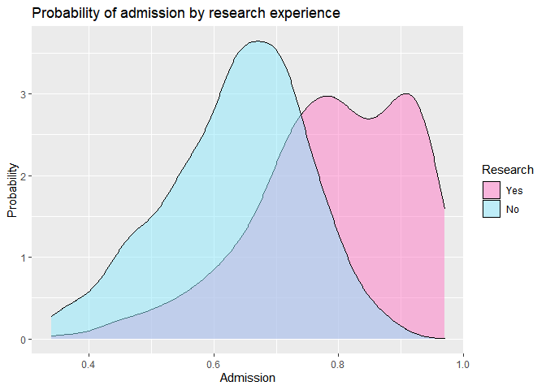
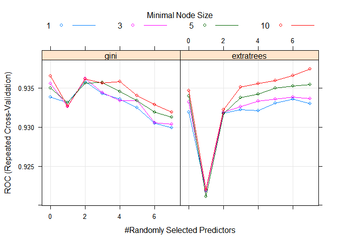
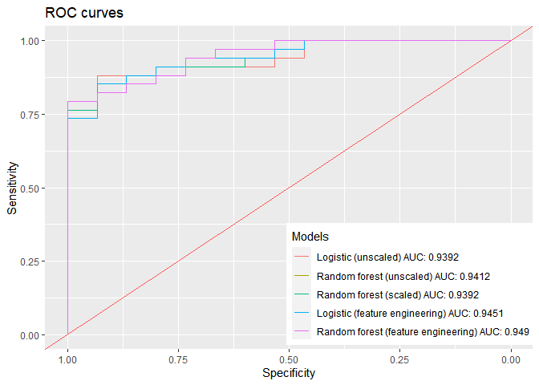

  - [Introduction](#introduction)
  - [Exploring the data](#exploring-the-data)
  - [Logistic regression](#logistic-regression)
      - [Diagnostics—logistic regression
        (unscaled)](#diagnosticslogistic-regression-unscaled)
  - [Bootstrap aggregated random forests \[Baggin’
    CARTs\]](#bootstrap-aggregated-random-forests-baggin-carts)
      - [Diagnostics—Random forest
        (unscaled)](#diagnosticsrandom-forest-unscaled)
  - [Random forests with
    preprocessing](#random-forests-with-preprocessing)
      - [Diagnostics—random forest
        (scaled)](#diagnosticsrandom-forest-scaled)
      - [Model comparison](#model-comparison)
  - [Conclusion](#conclusion)

# Introduction

The Python port of the code may be found
[here](https://github.com/joshuamegnauth54/KagglePractice/blob/master/Admissions2/Python/admissions2.py).

The source code for this Rmd may be found
[here](https://github.com/joshuamegnauth54/KagglePractice/blob/master/Admissions2/R/admissions2.Rmd).

The data set used may be found
[here](https://www.kaggle.com/mohansacharya/graduate-admissions).

``` r
library(kableExtra)
library(parallel)
library(doParallel)
library(pROC)
library(ranger)
library(caret)
library(tidyverse)
library(ggplot2)
library(broom)

# Dracula colors
# https://draculatheme.com/
# Obviously not following the theme yet.
PINK <- "#ff79c6"
CYAN <- "#8be9fd"
GREEN <- "#50fa7b"
PURPLE <- "#bd93f9"
RED <- "#ff5555"
BACKGROUND <- "#282a36"

# Threshold for the outcomes (i.e. above THRESHOLD = a success)
THRESHOLD <- 0.65

admissions_name <- "Admission_Predict_Ver1.1.csv"
admissions_cols <- c("id", "gre", "toefl", "uni_ratings", "statement",
                     "letter", "cgpa", "research", "prob_admit")
admissions_types <- "iiifdddld"

admissions <- 
  read_csv(admissions_name, col_names = admissions_cols,
           col_types = admissions_types, skip = 1) %>%
  select(-id) %>%
  mutate(research = as_factor(if_else(research, "Yes", "No")))

cluster_mp <- makeCluster(detectCores() - 1)
registerDoParallel(cluster_mp)

options(scipen = 16, knitr.table.format = "markdown")
set.seed(314)
rm(admissions_name, admissions_cols, admissions_types)
```

The [graduate admissions
data](https://www.kaggle.com/mohansacharya/graduate-admissions) data set
is not immediately attractive at first glance. The data set is sparse,
utilitarian, and tractable. Utility is a function of the data’s
admittedly humdrum goal of predicting graduate school admissions from
dreary tests. However, the data set is also yielding due to the
directness of the variables and the lack of cleaning required.

For those reasons I had been drawn to this data as a first, small
project to play around with in R and Python.

Let’s quickly go over the code above. **THRESHOLD** is a constant to
separate the positive predictions from the negative—that is, admissions
from non-admissions. I selected **0.65** as a probability after
exploring the data below which means that the value is a judgement call
rather than a science. As a parameter, a statistician or data scientist
may tune the threshold for separating the classes depending on the
teleology of the problem. Finally, 0.65 is hardly perfect, but I found
the value to perform well.

Anyway, the code to load the data isn’t all that interesting. I manually
skipped the header row, renamed the columns, and set the types. I
converted *research* to a factor with the levels renamed as “Yes” and
“No” as TRUE/FALSE are invalid names in R.
[Caret](https://topepo.github.io/caret/)—a machine learning library
developed by Max Kuhn—throws an exception when invalid names are used.

I’m also putting my
[i7](https://en.wikipedia.org/wiki/List_of_Intel_Core_i7_microprocessors)
to work with multiprocessing via
[doParallel](https://cran.r-project.org/web/packages/doParallel/index.html).
Training hundreds of models is an example of a problem that is
[embarrassingly
parallel](https://en.wikipedia.org/wiki/Embarrassingly_parallel), so I
suggest that anyone using cross validation and grid search look into
multiprocessing via Python or R.

As of 8/2/2020 I have set a seed of **314.** My random seed will always
be 324, 314, 428, or 42. My code is open source with each commit
available on GitHub to confirm I am not tampering with random seeds.

# Exploring the data

``` r
standardize <- function(variable) {
  (variable - mean(variable))/sd(variable)
}

thresh_to_fac <- function(data, threshold = THRESHOLD) {
  # Factor levels are created by order, so I need to ensure the order for
  # the negative class is explicit.
  temp <- as_factor(if_else(data > threshold, "Yes", "No"))
  relevel(temp, "No")
}

train_test_split <- function(X, y, test_size = .2) {
  len <- length(X)
  rows <- sample(len)
  split <- test_size * len
  
  X_test <- X[1:split]
  y_test <- y[1:split]

  X_train <- X[split + 1:len]
  y_train <- y[split + 1:len]
  
  list(X_train, y_train, X_test, y_test)
}

admissions %>%
  mutate(gre_stdize = standardize(gre),
         toefl_stdize = standardize(toefl)) %>%
  ggplot() +
  geom_histogram(aes(gre_stdize), binwidth = .25,
                 color = BACKGROUND, fill = GREEN) +
  geom_histogram(aes(toefl_stdize), binwidth = .25,
                 color = BACKGROUND, fill = PINK, alpha = 0.5) +
  xlab("GRE [green] and TOEFL [pink]") +
  ylab("Frequency") +
  ggtitle("Standardized GRE and TOEFL scores")
```

<!-- -->

``` r
head(admissions)
```

<div data-pagedtable="false">

<script data-pagedtable-source type="application/json">
{"columns":[{"label":["gre"],"name":[1],"type":["int"],"align":["right"]},{"label":["toefl"],"name":[2],"type":["int"],"align":["right"]},{"label":["uni_ratings"],"name":[3],"type":["fctr"],"align":["left"]},{"label":["statement"],"name":[4],"type":["dbl"],"align":["right"]},{"label":["letter"],"name":[5],"type":["dbl"],"align":["right"]},{"label":["cgpa"],"name":[6],"type":["dbl"],"align":["right"]},{"label":["research"],"name":[7],"type":["fctr"],"align":["left"]},{"label":["prob_admit"],"name":[8],"type":["dbl"],"align":["right"]}],"data":[{"1":"337","2":"118","3":"4","4":"4.5","5":"4.5","6":"9.65","7":"Yes","8":"0.92"},{"1":"324","2":"107","3":"4","4":"4.0","5":"4.5","6":"8.87","7":"Yes","8":"0.76"},{"1":"316","2":"104","3":"3","4":"3.0","5":"3.5","6":"8.00","7":"Yes","8":"0.72"},{"1":"322","2":"110","3":"3","4":"3.5","5":"2.5","6":"8.67","7":"Yes","8":"0.80"},{"1":"314","2":"103","3":"2","4":"2.0","5":"3.0","6":"8.21","7":"No","8":"0.65"},{"1":"330","2":"115","3":"5","4":"4.5","5":"3.0","6":"9.34","7":"Yes","8":"0.90"}],"options":{"columns":{"min":{},"max":[10]},"rows":{"min":[10],"max":[10]},"pages":{}}}
  </script>

</div>

I standardized the variables for GRE and TOEFL scores due to the
different scales. Working with standardized or normalized variables is
often just plain easier. The process of standardizing a variable is
simple. We’d like a standard deviation of 1 and a mean of zero, so we
can simple subtract the mean of the variable from each score and divide
by the standard deviation. In other words, we’re taking the z score of
each value.

\[z = \frac{x - \mu}{\sigma}\]

The distributions for GRE and TOEFL scores seem fairly similar as we can
see from the histograms. In some cases, such as the range from a
standard deviation of **0 to 1**, the distributions are near identical.

I wrote a function, **thresh\_to\_fac()**, to encapsulate converting
probabilities to a factor using a threshold. The function cleans up my
code a bit when I have to convert probabilities. My function first
converts all cases where a column (the parameter **data**) is greater
than the threshold to “Yes” or “No.” The “Yes” and “No” values are
converted to a factor which in turn is releveled to ensure “No” is the
first or zeroth case.

``` r
admissions %>%
  ggplot() +
  geom_density(aes(prob_admit, fill = research), alpha = 0.5) +
  scale_fill_manual(values = c(PINK, CYAN)) +
  labs(fill = "Research") +
  xlab("Admission") +
  ylab("Probability") +
  ggtitle("Probability of admission by research experience")
```

<!-- -->

The probability of admission seems normally distributed for students
without research experience while positively skewed for students with
projects. Both modes peak past the midway point of **0.5**. My initial
guess is that setting a threshold of **0.65** would catch more *true
positives* than using **0.5**. I wouldn’t happily cartwheel around my
room at 50-50 odds for school admissions. Likewise, a strict separation
at 50% could risk incorrect predictions especially when reasonable
students wouldn’t bet on such low odds.

A higher threshold logically risks more false negatives—cases where
students would be admitted but the model predicted rejection. However, a
greater false negatives rate is less risky than false positives here in
my opinion. Applying to schools only to be declined seems more
individually taxing than false negatives unless the rate for the latter
is unreasonably high.

``` r
admissions %>%
  select(gre, toefl, statement, letter) %>%
  rename(GRE = gre, TOEFL = toefl, SoP = statement,
         LoR = letter) %>%
  cor() %>%
  kable() %>%
  kable_styling(bootstrap_options = c("striped", "hover", "condensed"))
```

    ## Warning in kable_styling(., bootstrap_options = c("striped", "hover",
    ## "condensed")): Please specify format in kable. kableExtra can customize
    ## either HTML or LaTeX outputs. See https://haozhu233.github.io/kableExtra/
    ## for details.

|       |       GRE |     TOEFL |       SoP |       LoR |
| :---- | --------: | --------: | --------: | --------: |
| GRE   | 1.0000000 | 0.8272004 | 0.6134977 | 0.5246794 |
| TOEFL | 0.8272004 | 1.0000000 | 0.6444104 | 0.5415633 |
| SoP   | 0.6134977 | 0.6444104 | 1.0000000 | 0.6637069 |
| LoR   | 0.5246794 | 0.5415633 | 0.6637069 | 1.0000000 |

GRE, TOEFL, Statements of Purpose ratings, and Letters of Recommendation
ratings are all at least somewhat correlated. The two tests, GRE and
TOEFL, are greatly correlated with \(R = 0.83\). Ditching at least one
of these variables may improve modeling or, at the very least, prevent
wonky coefficients.

# Logistic regression

``` r
admissions <- admissions %>%
  mutate(y_admit = thresh_to_fac(prob_admit))

basic_form <- y_admit ~ gre + uni_ratings + cgpa + statement + letter + research
basic_mod <- glm(basic_form, "binomial", admissions)

tidy(basic_mod, conf.int = TRUE, exponentiate = TRUE)
```

<div data-pagedtable="false">

<script data-pagedtable-source type="application/json">
{"columns":[{"label":["term"],"name":[1],"type":["chr"],"align":["left"]},{"label":["estimate"],"name":[2],"type":["dbl"],"align":["right"]},{"label":["std.error"],"name":[3],"type":["dbl"],"align":["right"]},{"label":["statistic"],"name":[4],"type":["dbl"],"align":["right"]},{"label":["p.value"],"name":[5],"type":["dbl"],"align":["right"]},{"label":["conf.low"],"name":[6],"type":["dbl"],"align":["right"]},{"label":["conf.high"],"name":[7],"type":["dbl"],"align":["right"]}],"data":[{"1":"(Intercept)","2":"4.078290e-23","3":"7.20749711","4":"-7.15279917","5":"0.0000000000008502596","6":"1.403700e-29","7":"0.00000000000000002904974"},{"1":"gre","2":"1.070561e+00","3":"0.02352874","4":"2.89784658","5":"0.0037573433503695001","6":"1.022819e+00","7":"1.12204220038496216282908"},{"1":"uni_ratings3","2":"1.052087e+00","3":"0.52483862","4":"0.09674632","5":"0.9229278580565407619","6":"3.672971e-01","7":"2.91458256277782545851096"},{"1":"uni_ratings2","2":"9.780920e-01","3":"0.54612561","4":"-0.04056125","5":"0.9676456780617656017","6":"3.326096e-01","7":"2.86878902195026030952363"},{"1":"uni_ratings5","2":"4.274803e+00","3":"1.38102790","4":"1.05192519","5":"0.2928338727686766174","6":"3.918512e-01","7":"117.33424686689504312653298"},{"1":"uni_ratings1","2":"6.551406e-01","3":"0.88996939","4":"-0.47519095","5":"0.6346508745701284759","6":"1.102500e-01","7":"3.68676280525630106765789"},{"1":"cgpa","2":"3.312541e+01","3":"0.57052808","4":"6.13519452","5":"0.0000000008505505625","6":"1.132754e+01","7":"106.81235372363680369289796"},{"1":"statement","2":"1.047627e+00","3":"0.23252537","4":"0.20009846","5":"0.8414035784517566174","6":"6.629564e-01","7":"1.65477678616176682169225"},{"1":"letter","2":"1.856278e+00","3":"0.22211671","4":"2.78490310","5":"0.0053543721114100015","6":"1.209696e+00","7":"2.89799283986015865366426"},{"1":"researchNo","2":"4.663327e-01","3":"0.32290692","4":"-2.36246386","5":"0.0181539113695700187","6":"2.458539e-01","7":"0.87569516897350840878289"}],"options":{"columns":{"min":{},"max":[10]},"rows":{"min":[10],"max":[10]},"pages":{}}}
  </script>

</div>

My first model is conservative and straightforward. I included only one
of the tests as the two test scores are correlated as we saw above. Of
course, a person/observation that has a certain score on one test is
likely to have a similar grade on the other test. Likewise, G.P.A.
shouldn’t deviate too wildly from TOEFL or GRE scores, but I included
the variable in this preliminary model to be safe.

The coefficients for the odds fall into the confidence intervals. The
confidence intervals are a bit fickle. For example, the confidence
intervals for *university ratings* are rather wide. P-values measure the
probability of results at least as extreme as what was observed given
that the null hypothesis is true. In other words, the p-value is
concerned with only the **probability of extreme events in terms of the
data** along with assuming the null hypothesis of no effect; we’re not
considering external information, as with a
[prior](https://en.wikipedia.org/wiki/Prior_probability), and the model
says nothing about truthiness. Only the odds coefficient of GRE scores,
cumulative G.P.A., and letters of recommendation scores may not be due
to random chance given \(\alpha = .05\).

Now let’s take a look at the appropriate coefficients\! Each additional
point gained on the GRE increases an applicant’s acceptance odds by
about 1.07. Cumulative G.P.A. boosts odds by about 33 for each
additional grade point average out of a maximum of ten.

The intercept is so low that it’s basically zero. But, technically each
applicant starts with an odds of .0000000000000000000000407829 if they
managed to have a zero GPA, failed the GRE with a zero, and wrote random
letters for their statement of purpose, et cetera…

## Diagnostics—logistic regression (unscaled)

Let’s test predictive ability. I fit my basic model on all of the rows
of data which in turn will be reused for prediction. Of course, I
realize that precluding a hold out set as well as using training data
for prediction are anti-patterns, but the model above is basic and
experimentation is fun\!

``` r
confusion_wrapper <- function(y_true, y_pred) {
  # Create a confusion matrix object via caret
  confusion <- confusionMatrix(y_pred, reference = y_true, positive = "Yes")
  
  # Generate a nice table from the matrix via kableExtra
  cmatrix <-
    confusion$table %>%
    kable(caption = "Rows = Predictions") %>%
    kable_styling(bootstrap_options = c("striped", "hover", "condensed"),
                  full_width = FALSE)
  
  # Likewise for the metrics
  metrics <-
    tidy(confusion) %>%
    select(term, estimate) %>%
    kable(col.names = c("Classification Function", "Value")) %>%
    kable_styling(bootstrap_options = c("striped", "hover", "condensed"))
  
  # Return both tables so they're automatically displayed
  list(ConfusionMatrix = cmatrix, Metrics = metrics)
}

basic_preds <- thresh_to_fac(predict(basic_mod, type = "response"))
confusion_wrapper(admissions$y_admit, basic_preds)
```

    ## Warning in kable_styling(., bootstrap_options = c("striped", "hover",
    ## "condensed"), : Please specify format in kable. kableExtra can customize
    ## either HTML or LaTeX outputs. See https://haozhu233.github.io/kableExtra/
    ## for details.

    ## Warning in kable_styling(., bootstrap_options = c("striped", "hover",
    ## "condensed")): Please specify format in kable. kableExtra can customize
    ## either HTML or LaTeX outputs. See https://haozhu233.github.io/kableExtra/
    ## for details.

$ConfusionMatrix

|     |  No | Yes |
| :-- | --: | --: |
| No  | 138 |  50 |
| Yes |  20 | 292 |

$Metrics

| Classification Function |     Value |
| :---------------------- | --------: |
| accuracy                | 0.8600000 |
| kappa                   | 0.6918797 |
| mcnemar                 |        NA |
| sensitivity             | 0.8538012 |
| specificity             | 0.8734177 |
| pos\_pred\_value        | 0.9358974 |
| neg\_pred\_value        | 0.7340426 |
| precision               | 0.9358974 |
| recall                  | 0.8538012 |
| f1                      | 0.8929664 |
| prevalence              | 0.6840000 |
| detection\_rate         | 0.5840000 |
| detection\_prevalence   | 0.6240000 |
| balanced\_accuracy      | 0.8636094 |

My basic model performs *pretty good* considering I conservatively hand
picked variables. With that said, I’ll repeat that I *tested* on my
*training* data so the model may be over fit with only decent
performance. Total accuracy is the ratio of correctly separated true
positive and true negatives over all of the classes total. Accuracy’s
major problem is that the two classes may be unbalanced. The canonical
example considers the test for an affliction where most test results are
negative. Let’s say that 99% of the cases in a data set for some
condition are negative. A classifier may achieve an accuracy score of
99% while predicting **literally every positive case incorrectly.**

The logistic model above achieves an accuracy of **86%** with a
sensitivity (true positive rate) of **85.4%**. Specificity, or correctly
sorting false cases, is similar at **87.4%**. The confusion matrix above
shows **20 false positives** and **50 false negatives**. I set a
threshold of 0.65 as discussed earlier. However, that high threshold may
have borked the sorting ability of the model considering that the data
is skewed towards positive cases as you can see below.

``` r
table(admissions$y_admit) %>%
  kable(col.names = c("Class", "Frequency")) %>%
  kable_styling(bootstrap_options = c("striped", "hover", "condensed"))
```

    ## Warning in kable_styling(., bootstrap_options = c("striped", "hover",
    ## "condensed")): Please specify format in kable. kableExtra can customize
    ## either HTML or LaTeX outputs. See https://haozhu233.github.io/kableExtra/
    ## for details.

| Class | Frequency |
| :---- | --------: |
| No    |       158 |
| Yes   |       342 |

How about we check model performance with the threshold set at 0.5? For
fun (and profit)\!

``` r
# This code is dreadful. Sorry.
fifty_pred <- admissions %>%
  mutate(y_admit = thresh_to_fac(prob_admit, threshold = .5)) %>%
  glm(basic_form, "binomial", data = .) %>%
  predict(type = "response") %>%
  thresh_to_fac(threshold = .5)

fifty_true <- thresh_to_fac(admissions$prob_admit, .5)
confusion_wrapper(fifty_true, fifty_pred)
```

    ## Warning in kable_styling(., bootstrap_options = c("striped", "hover",
    ## "condensed"), : Please specify format in kable. kableExtra can customize
    ## either HTML or LaTeX outputs. See https://haozhu233.github.io/kableExtra/
    ## for details.

    ## Warning in kable_styling(., bootstrap_options = c("striped", "hover",
    ## "condensed")): Please specify format in kable. kableExtra can customize
    ## either HTML or LaTeX outputs. See https://haozhu233.github.io/kableExtra/
    ## for details.

$ConfusionMatrix

|     | No | Yes |
| :-- | -: | --: |
| No  | 19 |   7 |
| Yes | 20 | 454 |

$Metrics

| Classification Function |     Value |
| :---------------------- | --------: |
| accuracy                | 0.9460000 |
| kappa                   | 0.5569703 |
| mcnemar                 |        NA |
| sensitivity             | 0.9848156 |
| specificity             | 0.4871795 |
| pos\_pred\_value        | 0.9578059 |
| neg\_pred\_value        | 0.7307692 |
| precision               | 0.9578059 |
| recall                  | 0.9848156 |
| f1                      | 0.9711230 |
| prevalence              | 0.9220000 |
| detection\_rate         | 0.9080000 |
| detection\_prevalence   | 0.9480000 |
| balanced\_accuracy      | 0.7359976 |

``` r
rm(fifty_pred, fifty_true)
```

Using my handy dandy ~~notebook~~ *thresh\_to\_fac()* function, I
generated a set of predictions as factors where the positive class is
defined as **0.51** and up.

A threshold of 0.5 is ostensibly better as the model above sports an
impressive **95%** accuracy with a sensitivity of **98.5%**. Specificity
is a major downgrade at **48%.** Take a gander at the confusion matrix.
My initial intuition from data exploration has been vindicated\!
Mostly\! A threshold of 0.5 leads to very few total amount of “No”
values. The 0.5 threshold model correctly predicts 454 of the positive
class, but that metric is meaningless since most values are “Yes.” A
threshold of 0.5 under performs because the classes are disingenuously
split even though the actual model technically performs well. Also, I’ll
reiterate that this model is fit on all of the data. The model is likely
over fit both due to the data used as well as the split used.

I’ll keep 0.65 as a threshold as the performance is stable.

``` r
admissions <- admissions %>%
  select(-prob_admit)
```

# Bootstrap aggregated random forests \[Baggin’ CARTs\]

Random forests is a clever name for a clever algorithm. An individual
decision tree continually splits data by attempting to satisfy a
criterion, such as maximizing information gain. The first split is known
as the root node which corresponds to the primary, major schism
determined by the algorithm. Each branch continues along the same
process until the data is exhaustively categorized or a predefined
stopping point is reached.

Of course, decision trees have more going in than a scant summary can
cover, but that’s the gist of the process. An individual decision tree
lacks robustness because of its singularity. A single decision tree may
hone in an optimal split, but a single split may be limiting in
comparison to having a range of choices. Random forests grows many trees
which are suboptimally learned leading to high bias. These trees
understand a subset (bootstrap sample) of the data as well as certain
patterns that are not ideal. However, random forest coalesces these
patterns via voting which leads to stronger models overall. Using
multiple trees solves another potential decision tree problem: over
fitting. A decision tree must usually be cut or trimmed so that it
doesn’t learn a data set’s noise. Fitting multiple weak learners helps
random forests generalize an understanding of the data rather than
learning its nuances.

``` r
rf_traincontrol <- trainControl(method = "repeatedcv",
                                number = 5,
                                repeats = 5,
                                search = "random",
                                savePredictions = TRUE,
                                classProbs = TRUE,
                                summaryFunction = twoClassSummary,
                                allowParallel = TRUE)

# mtry_default <- floor(sqrt(ncol(admissions) - 1))
rf_grid <- expand.grid(mtry = 1:ncol(admissions) - 1,
                       splitrule = c("gini", "extratrees"),
                       min.node.size = c(1, 3, 5, 10))

rf_model_nopreproc <- train(y_admit ~ .,
                            method = "ranger",
                            trControl = rf_traincontrol,
                            tuneGrid = rf_grid,
                            metric = "ROC",
                            data = admissions)
```

The two highest rated answers on a question about [preprocessing for
random
forests](https://stats.stackexchange.com/questions/172842/best-practices-with-data-wrangling-before-running-random-forest-predictions)
on Stack Overflow conflict. Wonderful\! Random forests should
theoretically be indifferent toward outliers or unimportant variables.
One answer describes the algorithm as fairly “off the shelf,” meaning
that one may deploy a CART without much wrangling. Another answer
explains that the theoretical prowess is sometimes wonky; all data
should be seasoned a bit before cooking.

Scaled variables shouldn’t harm nor help information gain at each cut of
the tree, but I’ll try the model both ways. Less complex models or
modeling processes should always be preferred, of course, even if
preprocessing doesn’t strictly harm anything.

The hyperparameter **mtry** refers to the number of variables that may
be possibly selected at each cut of the tree (this explanation may be
off). By [default
mtry](https://cran.r-project.org/web/packages/ranger/ranger.pdf) is set
to the floor of the square root of the number of variables which is \~2
in this case.

Cross validation refers to a class of processes for testing model
stability. Cross validation splits the data into *k* folds and uses
*k-1* folds for training with the extra set used for testing. I’m using
**repeated cross validation** as the data are rather limited at 500
rows. I’m avoiding splitting the data into training and test sets for
the first model due to that reason as well. I originally used **leave
one out cross validation** which trains the model *N* times (k == N).
LOOCV is clearly computational expensive but provides very conservative
estimates of model performance. However, I’ve found that LOOCV, CV, and
repeated CV all offer same conclusions since the model is fairly stable.
In other words, error doesn’t vary wildly across folds. While I could
stick with k fold cross validation, repeated CV seems to be idiomatic
for a data set of this size.

## Diagnostics—Random forest (unscaled)

``` r
rf_model_nopreproc$bestTune
```

<div data-pagedtable="false">

<script data-pagedtable-source type="application/json">
{"columns":[{"label":[""],"name":["_rn_"],"type":[""],"align":["left"]},{"label":["mtry"],"name":[1],"type":["dbl"],"align":["right"]},{"label":["splitrule"],"name":[2],"type":["fctr"],"align":["left"]},{"label":["min.node.size"],"name":[3],"type":["dbl"],"align":["right"]}],"data":[{"1":"7","2":"extratrees","3":"10","_rn_":"64"}],"options":{"columns":{"min":{},"max":[10]},"rows":{"min":[10],"max":[10]},"pages":{}}}
  </script>

</div>

``` r
plot(rf_model_nopreproc)
```

<!-- -->

``` r
rf_y_pred_nopre <- relevel(predict(rf_model_nopreproc), "No")
confusion_wrapper(admissions$y_admit, rf_y_pred_nopre)
```

    ## Warning in kable_styling(., bootstrap_options = c("striped", "hover",
    ## "condensed"), : Please specify format in kable. kableExtra can customize
    ## either HTML or LaTeX outputs. See https://haozhu233.github.io/kableExtra/
    ## for details.

    ## Warning in kable_styling(., bootstrap_options = c("striped", "hover",
    ## "condensed")): Please specify format in kable. kableExtra can customize
    ## either HTML or LaTeX outputs. See https://haozhu233.github.io/kableExtra/
    ## for details.

$ConfusionMatrix

|     |  No | Yes |
| :-- | --: | --: |
| No  | 147 |  10 |
| Yes |  11 | 332 |

$Metrics

| Classification Function |     Value |
| :---------------------- | --------: |
| accuracy                | 0.9580000 |
| kappa                   | 0.9026769 |
| mcnemar                 |        NA |
| sensitivity             | 0.9707602 |
| specificity             | 0.9303797 |
| pos\_pred\_value        | 0.9679300 |
| neg\_pred\_value        | 0.9363057 |
| precision               | 0.9679300 |
| recall                  | 0.9707602 |
| f1                      | 0.9693431 |
| prevalence              | 0.6840000 |
| detection\_rate         | 0.6640000 |
| detection\_prevalence   | 0.6860000 |
| balanced\_accuracy      | 0.9505700 |

The model with the highest Receiver Operating Characteristic (ROC) ratio
was trained with an **mtry** of 7 using the **extremely randomized trees
(Extra Trees)** algorithm with a minimum node size of **10**. Using Gini
impurity seems to work best with an *mtry* of two with this data. Extra
trees works best with an *mtry* of six and a minimal node size of ten
with this data.

# Random forests with preprocessing

``` r
train_index <- createDataPartition(admissions$y_admit, p = 0.9)$Resample1

X_train <- admissions %>%
  slice(train_index) %>%
  select(-y_admit)

y_train <- admissions %>%
  slice(train_index) %>%
  select(y_admit) %>%
  unlist()

X_test <- admissions %>%
  slice(-train_index) %>%
  select(-y_admit)

y_test <- admissions %>%
  slice(-train_index) %>%
  select(y_admit) %>%
  unlist()

rf_model_preproc <- train(x = X_train,
                          y = y_train,
                          method = "ranger",
                          preProcess = c("scale", "pca"),
                          trControl = rf_traincontrol,
                          tuneGrid = rf_grid,
                          metric = "ROC")
```

My second random forests model preprocesses the variables by scaling
numeric features and determining principal components via PCA. I also
use training and holdout sets (which I should have just done initially
as I gained nothing but created extra work for myself by modelling using
all of the data).

## Diagnostics—random forest (scaled)

``` r
rf_model_preproc$bestTune
```

<div data-pagedtable="false">

<script data-pagedtable-source type="application/json">
{"columns":[{"label":[""],"name":["_rn_"],"type":[""],"align":["left"]},{"label":["mtry"],"name":[1],"type":["dbl"],"align":["right"]},{"label":["splitrule"],"name":[2],"type":["fctr"],"align":["left"]},{"label":["min.node.size"],"name":[3],"type":["dbl"],"align":["right"]}],"data":[{"1":"6","2":"extratrees","3":"10","_rn_":"56"}],"options":{"columns":{"min":{},"max":[10]},"rows":{"min":[10],"max":[10]},"pages":{}}}
  </script>

</div>

``` r
rf_ypred_preproc <- relevel(predict(rf_model_preproc, newdata = X_test), "No")
confusion_wrapper(y_test, rf_ypred_preproc)
```

    ## Warning in kable_styling(., bootstrap_options = c("striped", "hover",
    ## "condensed"), : Please specify format in kable. kableExtra can customize
    ## either HTML or LaTeX outputs. See https://haozhu233.github.io/kableExtra/
    ## for details.

    ## Warning in kable_styling(., bootstrap_options = c("striped", "hover",
    ## "condensed")): Please specify format in kable. kableExtra can customize
    ## either HTML or LaTeX outputs. See https://haozhu233.github.io/kableExtra/
    ## for details.

$ConfusionMatrix

|     | No | Yes |
| :-- | -: | --: |
| No  | 10 |   3 |
| Yes |  5 |  31 |

$Metrics

| Classification Function |     Value |
| :---------------------- | --------: |
| accuracy                | 0.8367347 |
| kappa                   | 0.6008147 |
| mcnemar                 |        NA |
| sensitivity             | 0.9117647 |
| specificity             | 0.6666667 |
| pos\_pred\_value        | 0.8611111 |
| neg\_pred\_value        | 0.7692308 |
| precision               | 0.8611111 |
| recall                  | 0.9117647 |
| f1                      | 0.8857143 |
| prevalence              | 0.6938776 |
| detection\_rate         | 0.6326531 |
| detection\_prevalence   | 0.7346939 |
| balanced\_accuracy      | 0.7892157 |

Unsurprisingly, a model that is trained on one segment of the data but
tested on unseen data performs a bit worse than that model that is
trained and tested on the same data. I mentioned above that I gave
myself extra work by not using a training set. I can’t really compare
these two models as they were trained and tested on different data.
However, I *really* want to compare the performance of the different
models. I’ll retrain the logistic and unpreprocessed models on the
training set then compare all of the models.

With that said, the confusion matrix above shows a very low specificity.
The low row count of the data set coupled with the fact that the test
set lacks observations as well seems to throw off predictions a bit. \#
Feature engineering and model comparisons Before I compare the models
above properly I’d like to try feature engineering to see if I can
improve performance.

``` r
admissions_fe <-
  admissions %>%
  mutate(tests = gre + toefl,
         tests = standardize(tests),
         extra_docs = statement + letter,
         extra_docs = standardize(extra_docs),
         cgpa = standardize(cgpa)) %>%
  select(tests, extra_docs, cgpa, uni_ratings, research, y_admit)

# Train-test split
Xy_train_fe <- admissions_fe %>%
  slice(train_index)

X_test_fe <- admissions_fe %>%
  slice(-train_index) %>%
  select(-y_admit)
```

Right\! So I added up the test scores then standardized the new
variable. TOEFL and GRE were correlated, but I’m assuming simply
combining them is a good way to use both variables. I kneaded statement
of purpose and letter of recommendation in the same way. My assumption,
which I’ll test below, is that I can erode whatever negative effects
correlation may have while squeezing out some extra performance. I
assume that logistic regression may be affected more by the feature
engineering due to random forest’s robustness, so let’s see if I’m
right\!

## Model comparison

``` r
levels = c("No", "Yes")

# Logistic
logi_standard <- glm(basic_form, "binomial", admissions[train_index, ])
logi_standard_pred <- predict(logi_standard, newdata = X_test,
                              type = "response")

# Random forest (unscaled)
rf_standard <- train(x = X_train,
                     y = y_train,
                     method = "ranger",
                     trControl = rf_traincontrol,
                     tuneGrid = rf_grid,
                     metric = "ROC")
rf_standard_pred <- predict(rf_standard, newdata = X_test, type = "prob")$Yes

# Random forest (scaled)
rf_preproc_pred <- predict(rf_model_preproc, newdata = X_test,
                           type = "prob")$Yes

# Logistic (feature engineering)
logi_fe <- glm(y_admit ~ ., family = "binomial", data = Xy_train_fe)
logi_fe_pred <- predict(logi_fe, newdata = X_test_fe, type = "response")

# Random forest (feature engineering)
rf_fe <- train(y_admit ~ .,
               data = Xy_train_fe,
               method = "ranger",
               trControl = rf_traincontrol,
               tuneGrid = rf_grid,
               metric = "ROC")
rf_fe_pred <- predict(rf_fe, newdata = X_test_fe, type = "prob")$Yes

# ROC calculation via pROC
roc_logistic <- roc(response = y_test, predictor = logi_standard_pred,
                    levels = levels)
roc_nopreproc_rf <- roc(response = y_test, predictor = rf_standard_pred,
                        levels = levels)
roc_preproc_rf <- roc(response = y_test, predictor = rf_preproc_pred,
                      levels = levels)
roc_log_fe <- roc(response = y_test, predictor = logi_fe_pred, levels = levels)
roc_rf_fe <- roc(response = y_test, predictor = rf_fe_pred, levels = levels)

# List of the above calculations to Purrr on
roc_list <- list(Logistic = roc_logistic, RF_Preprocessed = roc_preproc_rf,
                 RF_NoPreprocess = roc_nopreproc_rf, LogisticFE = roc_log_fe,
                 RF_FE = roc_rf_fe)

# List of labels for Purrr.
roc_names = list("Logistic (unscaled)",
                 "Random forest (unscaled)",
                 "Random forest (scaled)",
                 "Logistic (feature engineering)",
                 "Random forest (feature engineering)")

# Actual labels to pass to ggroc. See explanation below.
roc_labels <- 
  roc_list %>%
  map(auc) %>%
  map_dbl(1) %>%
  map_dbl(~round(., 4)) %>%
  map2_chr(roc_names, ~paste(.y, "AUC:", .x))

# ROC curves
ggroc(roc_list) +
  geom_abline(slope = 1, intercept = 1, color = RED) +
  xlab("Specificity") +
  ylab("Sensitivity") +
  ggtitle("ROC curves") +
  theme(legend.position = c(0.75, 0.2),
        legend.direction = "vertical") +
  scale_color_discrete(name = "Models",
                       labels = roc_labels)
```

<!-- -->

The code above looks very verbose, but I’m not doing anything really
extravagant here besides [Purrr](https://purrr.tidyverse.org/) (meow).
First, I retrain the models using the same subset of data—that is, the
same split of rows. Next, I calculate predictions which are output as
probabilities. Finally, I calculate the ROC using pROC and plot all of
the curves on the same graph.

The Purrr code creates a list of strings that concatenate the names of
the models with the AUC value. I map the
[auc](https://rdrr.io/cran/pROC/man/auc.html) function onto the list of
ROC objects followed by pulling out the second element from the new list
of auc objects as well as rounding the values using **map\_dbl** from
Purrr. Auc’s second element is the actual AUC. Finally, I concatenate
each string from the list of names with the pulled AUC values.

ROC plots the trade off between two metrics—typically sensitivity versus
specificity. Better models would output probabilities that sort the
classes better. For example, a perfect model would assign very high or
near one probabilities for the positive class. We wouldn’t have a trade
off between the two classes based on our threshold if we had a perfect
model\! Of course, perfect models don’t really exist, so ROC curves also
help us determine an appropriate cut off point.

The Area Under the Curve or AUC is basically integration. Or, actually,
I’m pretty sure AUC is, in fact, just integration. Anywho, AUC shows how
much area is under the ROC curve(s), as the name states explicitly.
Perfect models would have AUCs very close to one. AUCs and ROCs are
extremely useful for comparing two classifiers. Each of the models
defined above perform similarly; they are basically separated by less
than 0.01 in terms of AUC. The ROC curves show similar performance as
well, but the models notably have gains in different areas. In other
words, the models’ ROC curves vary at different thresholds so that no
one model is wholly superior.

Regardless, comparing models to pick that which has even the slightest
performance advantage is always fun. My feature engineered models
perform slightly better than the other models.

I win.

# Conclusion

I started with the *admissions2* data because I didn’t think I’d spend
hours working on something so elementary. I desired a fast project to
actually work on data rather than my normal modus operandi of dithering.
Data science is comparable to a video game, like Warcraft III or Kingdom
Hearts. Players act within a domain where they must understand the logic
of the system and how to manipulate it to achieve their goals. Video
games are mentally taxing but thrilling. Data science is similar because
you use the tools (that is, coding, math, and algorithms) to unravel a
puzzle. At each turn I thought to myself, “what could I do to improve my
position?”—much like I would while playing, say, an RPG. As I read more
on data science I realize that other people essentially view data
engineering, science, and analysis much like a game as well. Isn’t
Kaggle essentially gamified data science? The highest echeleon of data
scientists seem to be those who can enter a flow-state by understanding
the world-system of the data they’re using; in that case, the data and
the math *clicks* rather than being a sequence of steps a person
follows.

``` r
stopCluster(cluster_mp)
```
